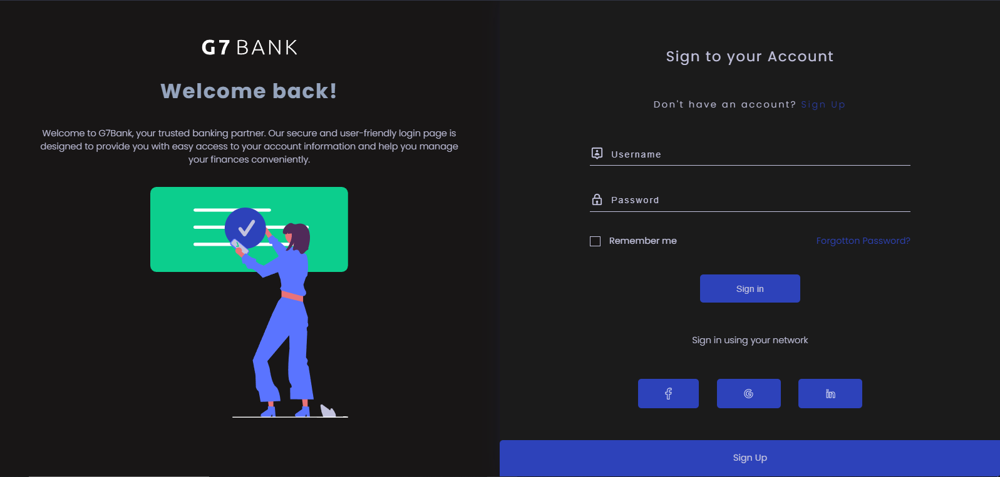
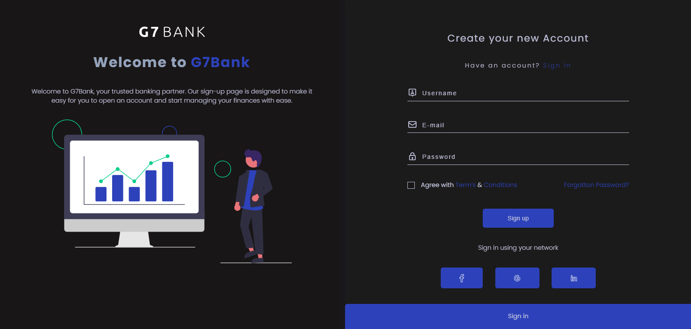
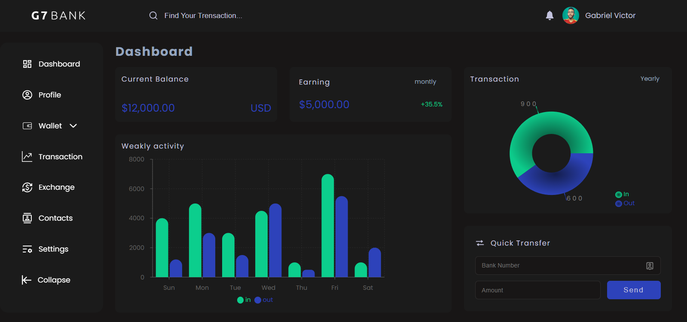
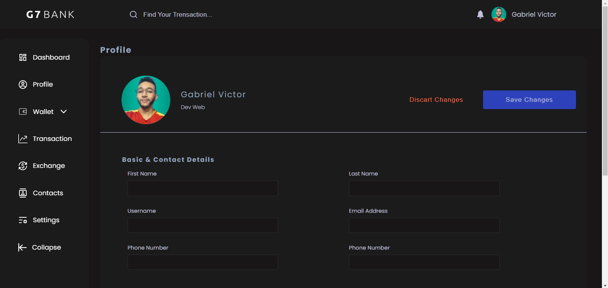

<h1>G7 BANK DASHBOARD</h1>

Bem-vindo ao repositório do G7Bank Dashboard, uma aplicação web que oferece uma interface amigável para gerenciar as operações bancárias com base na plataforma online DOTBANK. Esta aplicação foi desenvolvida para tornar a gestão financeira mais simples e eficiente para clientes do DOTBANK.

<h3>Visão Geral</h3>

O G7Bank Dashboard é uma aplicação web construída usando tecnologias modernas como HTML5, CSS3, JavaScript e [Framework XYZ] para fornecer uma experiência de usuário suave e funcionalidades avançadas para a gestão de contas bancárias.

<h3>Funcionalidades Principais</h3>
<ul>
<li>
<b>Login Seguro:</b>Os usuários podem fazer login com segurança em suas contas DOTBANK através de autenticação de dois fatores (2FA).
</li>
<li>
<b>Visão Geral da Conta: </b> Os clientes podem visualizar facilmente informações sobre suas contas, incluindo saldo atual, histórico de transações e muito mais.
</li>
<li>
<b>Transferências: </b>Realize transferências de fundos entre contas DOTBANK de forma rápida e segura.
</li>
<li>
<b>Pagamentos:</b>Pague contas, boletos e outras despesas com facilidade usando a funcionalidade de pagamento integrada.
</li>
<li>
<b>Relatórios Financeiros:</b>Gere relatórios detalhados de suas transações e atividades financeiras para um melhor controle.
</li>
<li>
<b>Login Seguro:</b>Os usuários podem fazer login com segurança em suas contas DOTBANK através de autenticação de dois fatores (2FA).
</li>
<li>
<b>Gráficos:</b>Analise os dados do seu negócio graficamente por meio de um dashboard interativo. 
</li>
</ul>
<h3>Telas</h3>
<ul>
    <li>
    <h5>Login</h5>
    
    </li>
    <li>
    <h5>Cadastro</h5>
    
    </li>
    <li>
    <h5>Dashboard</h5>
    
    </li>
    <li>
    <h5>Perfil</h5>
    
    </li>
</ul>
<h3>Licença</h3>

Este projeto é distribuído sob a licença MIT. Consulte o arquivo <a href='https://github.com/Gabriel-Vict0r/g7bank-dashboard/blob/main/LICENSE'>LICENSE</a> para obter mais informações.
